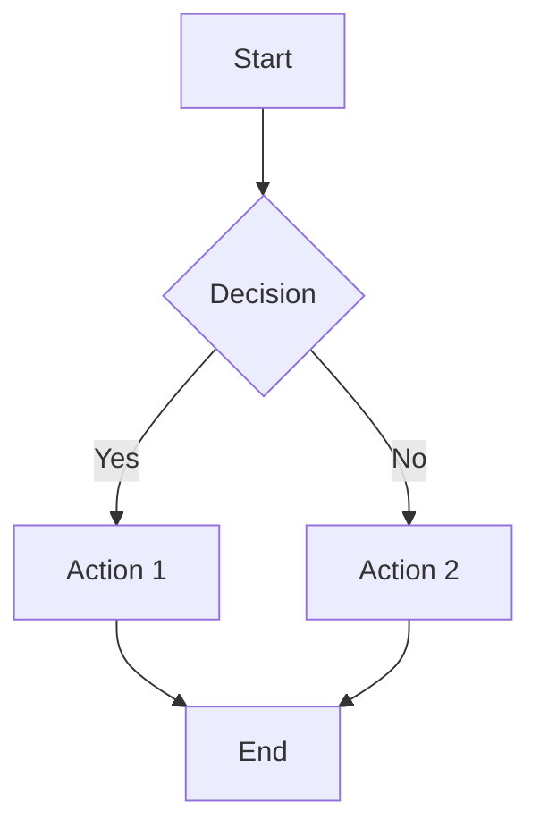
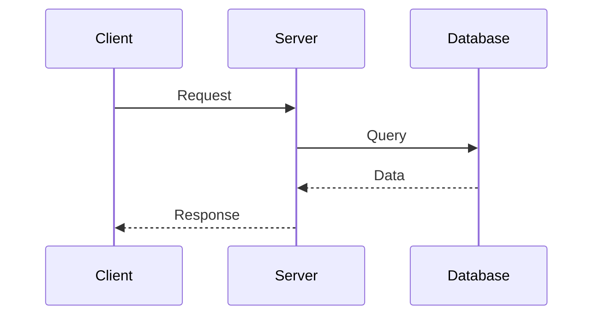
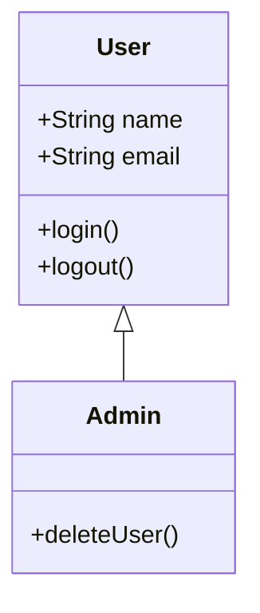
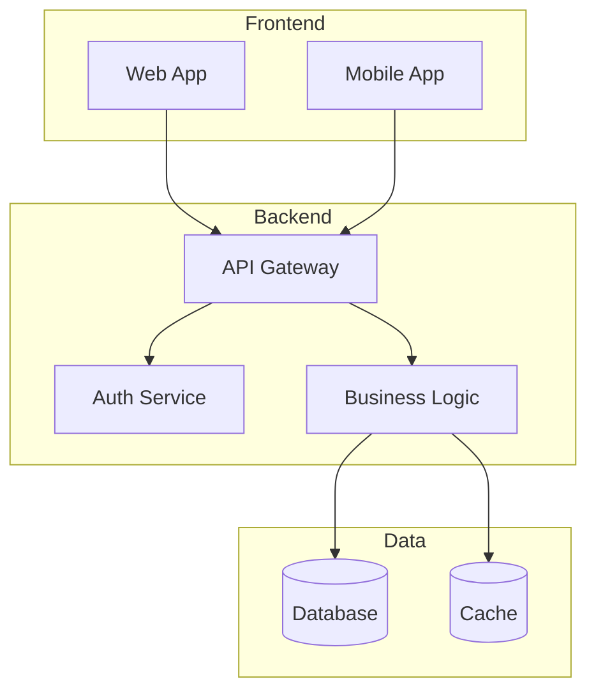

# Руководство по навыкам агентов (Skills)

## Что такое Skills?

Skills (навыки) — это расширенные возможности для агентов, представляющие собой комплексные пакеты с инструкциями, дополнительными файлами, скриптами и шаблонами. В отличие от slash-команд, skills активируются автоматически Claude при необходимости.

**Ключевые отличия от Commands:**

| Характеристика | Skills | Commands |
|----------------|--------|----------|
| Активация | Автоматическая | Ручная через `/` |
| Структура | Папка с файлами | Один md файл |
| Сложность | Комплексные процессы | Простые задачи |
| Файлы | Много файлов | Один файл |
| Скрипты | Да | Ограниченно |

## Структура файлов

### Расположение

**Проектные навыки** (для команды):
```
.claude/skills/skill-name/
└── SKILL.md
```

**Пользовательские навыки** (личные):
```
~/.claude/skills/skill-name/
└── SKILL.md
```

**Приоритет:** Проектные > Пользовательские

### Полная структура навыка

```
.claude/skills/my-skill/
├── SKILL.md              # Основной файл (обязательный)
├── reference.md          # Справочная информация
├── examples.md           # Примеры использования
├── templates/            # Шаблоны
│   ├── template1.txt
│   └── template2.md
└── scripts/              # Вспомогательные скрипты
    ├── helper.py
    └── process.sh
```

## Формат SKILL.md

### Базовая структура

```markdown
---
name: skill-name
description: Краткое описание навыка и когда его использовать
allowed-tools: Read, Write, Bash
---

# Название навыка

## Инструкции
Детальные пошаговые инструкции для Claude.

## Примеры
Конкретные примеры использования.

## Дополнительные файлы
Ссылки на другие файлы в этой папке.
```

### YAML параметры

#### name (обязательный)
Идентификатор навыка.

```yaml
name: pdf-processor
```

**Правила:**
- Только строчные буквы, цифры и дефисы
- Максимум 64 символа
- Уникальное имя

#### description (обязательный)
Описание навыка и условий использования.

```yaml
description: Извлекает текст и таблицы из PDF файлов, заполняет формы, объединяет документы. Используй при работе с PDF файлами.
```

**Важно:**
- Укажите ЧТО делает навык
- Укажите КОГДА его использовать
- Включите триггерные слова
- Максимум 1024 символа

#### allowed-tools (опциональный)
Ограничение инструментов для навыка.

```yaml
allowed-tools: Read, Write, Bash, Grep
```

## Прогрессивное раскрытие

Claude читает дополнительные файлы только когда они нужны — это экономит контекст.

**Пример:**
```markdown
Детальная справка по API доступна в @reference.md

Примеры кода смотри в @examples.md

Используй шаблон из @templates/api-response.json
```

Claude загрузит эти файлы только при необходимости.

## Примеры Skills

### 1. PDF Processor

`.claude/skills/pdf-processor/SKILL.md`
```markdown
---
name: pdf-processor
description: Извлекает текст и таблицы из PDF файлов, заполняет формы, объединяет документы. Используй при работе с PDF файлами.
allowed-tools: Read, Write, Bash
---

# PDF Processor

Навык для работы с PDF документами.

## Возможности

1. **Извлечение текста**
   - Полный текст документа
   - Конкретные страницы
   - Структурированные данные

2. **Работа с таблицами**
   - Извлечение таблиц
   - Конвертация в CSV/JSON
   - Анализ данных

3. **Манипуляция PDF**
   - Объединение файлов
   - Разделение документов
   - Извлечение страниц
   - Заполнение форм

4. **Конвертация**
   - PDF → Text
   - PDF → Images
   - Images → PDF

## Инструменты

Используй следующие команды:

```bash
# Извлечение текста
pdftotext input.pdf output.txt

# Извлечение таблиц
tabula -o output.csv input.pdf

# Объединение PDF
pdfunite file1.pdf file2.pdf output.pdf

# Разделение по страницам
pdftk input.pdf burst output page_%02d.pdf
```

## Процесс

1. Проверь наличие инструментов
2. Определи тип задачи
3. Выполни операцию
4. Валидируй результат
5. Сохрани выходной файл

## Примеры использования

См. @examples.md для детальных примеров.

## Обработка ошибок

- Проверяй формат файла
- Валидируй PDF перед обработкой
- Обрабатывай защищенные PDF
- Логируй ошибки
```

`.claude/skills/pdf-processor/examples.md`
```markdown
# Примеры использования PDF Processor

## Извлечение текста

```bash
# Весь документ
pdftotext document.pdf output.txt

# Конкретные страницы (1-5)
pdftotext -f 1 -l 5 document.pdf output.txt

# С сохранением layout
pdftotext -layout document.pdf output.txt
```

## Извлечение таблиц

```bash
# Все таблицы в CSV
tabula -o tables.csv document.pdf

# Конкретная область
tabula -a 100,50,500,800 document.pdf

# JSON формат
tabula -f JSON document.pdf
```

## Объединение PDF

```bash
# Объединить несколько файлов
pdfunite file1.pdf file2.pdf file3.pdf merged.pdf
```

## Разделение PDF

```bash
# Каждая страница в отдельный файл
pdftk input.pdf burst

# Извлечь страницы 1-5
pdftk input.pdf cat 1-5 output pages1-5.pdf
```
```

### 2. Diagram Generator

`.claude/skills/diagram-generator/SKILL.md`
```markdown
---
name: diagram-generator
description: Создает диаграммы и схемы используя Mermaid, PlantUML, Graphviz. Используй когда нужно визуализировать архитектуру, процессы, данные.
allowed-tools: Write, Bash
---

# Diagram Generator

Создание диаграмм и визуализаций.

## Типы диаграмм

### 1. Mermaid
- Flowcharts (блок-схемы)
- Sequence diagrams (последовательности)
- Class diagrams (классы)
- Entity Relationship (ER диаграммы)
- Gantt charts
- Git graphs

### 2. PlantUML
- UML диаграммы
- Архитектурные схемы
- Deployment diagrams

### 3. Graphviz (DOT)
- Графы
- Деревья
- Сети

## Шаблоны

Доступные шаблоны в `@templates/`

### Flowchart


### Sequence Diagram


### Class Diagram


## Процесс создания

1. Определи тип диаграммы
2. Выбери подходящий инструмент
3. Используй шаблон из `@templates/`
4. Адаптируй под конкретную задачу
5. Сгенерируй файл
6. Опционально: конвертируй в изображение

## Генерация изображений

```bash
# Mermaid → PNG
mmdc -i diagram.mmd -o diagram.png

# PlantUML → PNG
plantuml diagram.puml

# Graphviz → PNG
dot -Tpng diagram.dot -o diagram.png
```

См. @examples.md для подробных примеров.
```

`.claude/skills/diagram-generator/templates/architecture.mmd`


### 3. API Client Generator

`.claude/skills/api-client/SKILL.md`
```markdown
---
name: api-client-generator
description: Генерирует API клиенты из OpenAPI/Swagger спецификаций для TypeScript, Python, Go. Используй когда нужно создать typed клиент для API.
allowed-tools: Read, Write, Bash, WebFetch
---

# API Client Generator

Автоматическая генерация typed API клиентов.

## Поддерживаемые языки

- TypeScript (axios, fetch)
- Python (requests, httpx)
- Go (net/http)
- JavaScript (axios, fetch)

## Процесс

### 1. Получение спецификации

```bash
# Загрузить OpenAPI spec
curl https://api.example.com/openapi.json > spec.json
```

Или прочитать локальный файл: `@spec.json`

### 2. Анализ спецификации

Извлечь:
- Endpoints
- Request/Response types
- Authentication
- Error types

### 3. Генерация клиента

Используй шаблоны из `@templates/client-{language}.template`

### 4. Типы данных

Генерируй строго типизированные интерфейсы:

```typescript
// Types
interface User {
  id: number;
  email: string;
  name: string;
}

interface CreateUserRequest {
  email: string;
  name: string;
  password: string;
}

// API Client
class APIClient {
  async getUser(id: number): Promise<User> { }
  async createUser(data: CreateUserRequest): Promise<User> { }
}
```

### 5. Error handling

```typescript
class APIError extends Error {
  constructor(
    public status: number,
    public code: string,
    message: string
  ) {
    super(message);
  }
}
```

### 6. Authentication

Поддержка:
- Bearer tokens
- API keys
- OAuth 2.0
- Basic auth

## Шаблоны

См. `@templates/` для language-specific шаблонов.

## Валидация

- Проверка типов во время компиляции
- Runtime валидация с Zod/Joi
- Автокомплит в IDE

Детальные примеры в @examples.md
```

`.claude/skills/api-client/templates/client-typescript.template`
```typescript
import axios, { AxiosInstance, AxiosError } from 'axios';

export class APIClient {
  private client: AxiosInstance;

  constructor(baseURL: string, apiKey?: string) {
    this.client = axios.create({
      baseURL,
      headers: {
        'Content-Type': 'application/json',
        ...(apiKey && { 'Authorization': `Bearer ${apiKey}` })
      }
    });

    this.setupInterceptors();
  }

  private setupInterceptors() {
    this.client.interceptors.response.use(
      response => response.data,
      error => this.handleError(error)
    );
  }

  private handleError(error: AxiosError) {
    if (error.response) {
      throw new APIError(
        error.response.status,
        error.response.data.code,
        error.response.data.message
      );
    }
    throw error;
  }

  // Generated methods...
}

export class APIError extends Error {
  constructor(
    public status: number,
    public code: string,
    message: string
  ) {
    super(message);
    this.name = 'APIError';
  }
}
```

### 4. Database Schema Manager

`.claude/skills/db-schema/SKILL.md`
```markdown
---
name: db-schema-manager
description: Управление схемой PostgreSQL БД - миграции, индексы, constraints, оптимизация. Используй для работы с базой данных.
allowed-tools: Read, Write, Bash
---

# Database Schema Manager

Управление PostgreSQL схемой и миграциями.

## Возможности

### 1. Генерация миграций
- Создание таблиц
- Изменение схемы
- Индексы
- Constraints
- Триггеры

### 2. Rollback
- Down миграции
- Безопасный откат
- Валидация

### 3. Оптимизация
- Анализ производительности
- Рекомендации по индексам
- Query optimization

## Структура миграций

```
migrations/
├── 20241023_001_create_users.sql
├── 20241023_002_add_indexes.sql
└── rollback/
    ├── 20241023_001_rollback.sql
    └── 20241023_002_rollback.sql
```

## Шаблоны

### Создание таблицы

```sql
-- Migration: Create users table
-- Date: 2024-10-23

BEGIN;

CREATE TABLE IF NOT EXISTS users (
    id SERIAL PRIMARY KEY,
    email VARCHAR(255) NOT NULL UNIQUE,
    name VARCHAR(255) NOT NULL,
    created_at TIMESTAMP DEFAULT CURRENT_TIMESTAMP,
    updated_at TIMESTAMP DEFAULT CURRENT_TIMESTAMP
);

-- Indexes
CREATE INDEX idx_users_email ON users(email);
CREATE INDEX idx_users_created_at ON users(created_at);

-- Triggers
CREATE OR REPLACE FUNCTION update_updated_at()
RETURNS TRIGGER AS $$
BEGIN
    NEW.updated_at = CURRENT_TIMESTAMP;
    RETURN NEW;
END;
$$ LANGUAGE plpgsql;

CREATE TRIGGER users_updated_at
    BEFORE UPDATE ON users
    FOR EACH ROW
    EXECUTE FUNCTION update_updated_at();

COMMIT;
```

### Rollback

```sql
-- Rollback: Create users table
-- Date: 2024-10-23

BEGIN;

DROP TRIGGER IF EXISTS users_updated_at ON users;
DROP FUNCTION IF EXISTS update_updated_at();
DROP INDEX IF EXISTS idx_users_created_at;
DROP INDEX IF EXISTS idx_users_email;
DROP TABLE IF EXISTS users;

COMMIT;
```

## Best Practices

См. @reference.md для полного списка best practices.

Основные:
- Всегда используй транзакции
- IF EXISTS / IF NOT EXISTS
- Создавай индексы CONCURRENTLY отдельно
- Тестируй на копии данных
- Версионируй миграции

Подробные примеры в @examples.md
```

### 5. Test Generator

`.claude/skills/test-generator/SKILL.md`
```markdown
---
name: test-generator
description: Генерирует comprehensive тесты (unit, integration, e2e) для JavaScript/TypeScript проектов. Используй после написания кода.
allowed-tools: Read, Write, Bash, Grep
---

# Test Generator

Автоматическая генерация тестов с полным покрытием.

## Типы тестов

### 1. Unit Tests
- Тестирование отдельных функций/методов
- Изоляция зависимостей (mocks)
- Быстрое выполнение

### 2. Integration Tests
- Взаимодействие компонентов
- Реальные сценарии
- Минимум моков

### 3. E2E Tests
- Полные user flows
- Реальное окружение
- Браузерное тестирование

## Frameworks

Поддерживаются:
- Jest / Vitest (Unit, Integration)
- Playwright / Cypress (E2E)
- React Testing Library (React)
- Supertest (API)

## Процесс генерации

### 1. Анализ кода
```bash
# Прочитать исходный код
@src/module.ts
```

### 2. Определение test cases
- Happy paths
- Edge cases
- Error handling
- Boundary conditions

### 3. Генерация тестов
Используй AAA pattern:
- Arrange (подготовка)
- Act (действие)
- Assert (проверка)

### 4. Моки и стабы
```typescript
jest.mock('./dependency');
const mockFn = jest.fn();
```

## Шаблоны

### Unit Test Template
```typescript
import { functionToTest } from './module';

describe('functionToTest', () => {
  describe('when given valid input', () => {
    it('should return expected result', () => {
      // Arrange
      const input = { value: 42 };
      const expected = 84;

      // Act
      const result = functionToTest(input);

      // Assert
      expect(result).toBe(expected);
    });
  });

  describe('when given invalid input', () => {
    it('should throw error', () => {
      // Arrange
      const invalidInput = null;

      // Act & Assert
      expect(() => functionToTest(invalidInput))
        .toThrow('Invalid input');
    });
  });
});
```

### Integration Test Template
```typescript
import request from 'supertest';
import app from './app';

describe('POST /api/users', () => {
  it('should create user and return 201', async () => {
    const response = await request(app)
      .post('/api/users')
      .send({ email: 'test@example.com', name: 'Test' })
      .expect(201);

    expect(response.body).toMatchObject({
      email: 'test@example.com',
      name: 'Test'
    });
  });
});
```

## Coverage

Стремись к:
- Statements: > 80%
- Branches: > 75%
- Functions: > 80%
- Lines: > 80%

## Запуск тестов

```bash
# Unit tests
npm test

# Coverage
npm test -- --coverage

# Watch mode
npm test -- --watch

# Specific file
npm test module.test.ts
```

Подробные примеры для разных фреймворков в @examples.md
```

## Работа с Skills

### Автоматическая активация

Claude сам определяет когда использовать навык на основе description:

```
Пользователь: "Извлеки таблицы из этого PDF"
Claude: "Я использую навык pdf-processor..."
→ Навык активируется автоматически
```

### Ссылки на дополнительные файлы

```markdown
Для детальной информации см. @reference.md
Примеры в @examples.md
Используй шаблон @templates/template.txt
```

Claude загрузит эти файлы когда понадобятся.

## Создание Skill

### Способ 1: Вручную

1. Создать папку `.claude/skills/my-skill/`
2. Создать `SKILL.md` с frontmatter
3. Добавить дополнительные файлы
4. Сохранить

### Способ 2: Попросить Claude

```
"Создай навык для работы с GraphQL API.
Он должен уметь генерировать typed queries,
валидировать schemas и создавать клиенты."
```

Claude создаст полную структуру навыка.

## Лучшие практики

### 1. Четкое description
Включите триггерные слова и сценарии использования:

❌ Плохо: `description: Помогает с документами`
✅ Хорошо: `description: Извлекает текст и таблицы из PDF файлов. Используй при работе с PDF документами.`

### 2. Модульная организация
Разбивайте на файлы по назначению:
```
skill/
├── SKILL.md          # Основные инструкции
├── reference.md      # Детальный справочник
├── examples.md       # Примеры
└── templates/        # Шаблоны
```

### 3. Используйте прогрессивное раскрытие
Не загружайте все файлы сразу — ссылайтесь на них:
```markdown
См. @reference.md для API документации
```

### 4. Unix-style paths
Используйте forward slashes:
```markdown
@templates/client.ts
@scripts/helper.py
```

### 5. Тестируйте навык
Проверьте работу перед использованием командой:
```
"Используй my-skill для обработки этого файла"
```

### 6. Документируйте примеры
Создавайте `examples.md` с реальными use cases:
```markdown
# Примеры

## Пример 1: Базовое использование
[Конкретный пример...]

## Пример 2: Advanced use case
[Сложный сценарий...]
```

### 7. Версионирование
Храните в git для sharing с командой:
```bash
git add .claude/skills/my-skill/
git commit -m "Add my-skill"
```

## Skills vs Commands vs Agents

### Skills
- ✅ Сложные многофайловые процессы
- ✅ Автоматическая активация
- ✅ Прогрессивное раскрытие
- ✅ Скрипты и шаблоны

### Commands
- ✅ Быстрые задачи
- ✅ Ручная активация через `/`
- ✅ Простые шаблоны
- ✅ Один файл

### Agents
- ✅ Специализированные помощники
- ✅ Собственный контекст
- ✅ Делегирование задач
- ✅ Выбор модели

## Troubleshooting

### Навык не активируется

**Проблема:** Claude не использует навык автоматически.

**Решения:**
1. Улучшите `description` — добавьте триггерные слова
2. Укажите в description КОГДА использовать навык
3. Проверьте имя папки и файла `SKILL.md`

### Дополнительные файлы не загружаются

**Проблема:** `@reference.md` не работает.

**Решения:**
1. Проверьте путь — относительно `SKILL.md`
2. Используйте Unix-style paths (`/`)
3. Убедитесь что файл существует

### Ошибка "invalid frontmatter"

**Проблема:** YAML не парсится.

**Решения:**
1. Проверьте синтаксис YAML
2. Закрывающие `---` на новой строке
3. Правильные отступы

## Расширенные техники

### Комбинирование Skills и Agents

Создайте агента, специализирующегося на использовании навыка:

`.claude/agents/pdf-expert.md`
```markdown
---
name: pdf-expert
description: Эксперт по работе с PDF. Используй для любых PDF задач.
tools: Read, Write, Bash
model: sonnet
---

Ты — эксперт по PDF документам.

Используй навык pdf-processor для всех операций с PDF:
- Извлечение текста
- Работа с таблицами
- Объединение документов
- Конвертация форматов

Всегда проверяй результат и валидируй выходные файлы.
```

### Навыки с внешними зависимостями

`.claude/skills/image-processor/SKILL.md`
```markdown
---
name: image-processor
description: Обработка изображений - resize, crop, optimize, format conversion. Используй для работы с картинками.
allowed-tools: Bash, Read, Write
---

# Image Processor

## Зависимости

Необходимые инструменты:
- ImageMagick
- OptiPNG
- JPEGoptim

Проверь наличие:
```bash
which convert magick optipng jpegoptim
```

Если отсутствуют, установи:
```bash
# macOS
brew install imagemagick optipng jpegoptim

# Ubuntu/Debian
apt-get install imagemagick optipng jpegoptim
```

[... остальные инструкции ...]
```

## Полезные ссылки

- 📚 [Официальная документация Skills](https://docs.claude.com/en/docs/claude-code/skills)
- 🔧 [Примеры навыков](https://docs.claude.com/en/docs/claude-code/skills#example-skills)
- 🤖 [Субагенты](https://docs.claude.com/en/docs/claude-code/sub-agents)
- ⚙️ [Настройки](https://docs.claude.com/en/docs/claude-code/settings)

---

**Следующий шаг:** Настройте [стили вывода](./04-output-styles.md) для форматирования ответов Claude.
